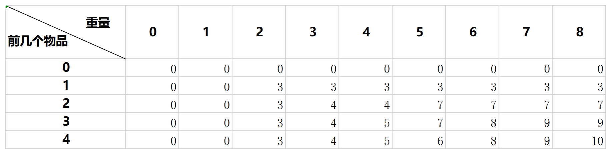

# 动态规划
动态规划算法是一种基础且十分重要的算法，但是说它是算法或许不太合适

动态规划算法不太像其他的算法一样，有着具体的公式和解法，无论变体如何，但是求解的方式是不变的

这也是难点，动态规划算法更多的更像是一种方法论，也就是它是一种解决问题的思考方法，根据这种方法所得到的一系列解法才是关键所在。

## 从01背包问题讲起
01背包问题是一个非常经典的动态规划算法问题，这个问题处处充斥着动态规划算法的影子

首先我们来看一下这个问题：

假如有一个重量为n的背包，和4个不同的物品，四个不同的物品编号和重量以及价值如下表

<table>
    <th>种类</th>
    <th>物品1</th>
    <th>物品2</th>
    <th>物品3</th>
    <th>物品4</th>
    <tr>
<th>ID</th>
<td>1</td>
<td>2</td>
<td>3</td>
<td>4</td>
    </tr>
    <tr>
<th>重量</th>
<td>2</td>
<td>3</td>
<td>4</td>
<td>5</td>
    </tr>
    <tr>
<th>价值</th>
<td>3</td>
<td>4</td>
<td>5</td>
<td>6</td>
    </tr> 
</table>

现在的问题是，如何才能算出此时背包中能装下的最大价值的物品。

其实首先，我们都可以想到并解决的一个方法就是暴力穷举，虽然傻并且低效，但我们也一定要将该方法拿出来说一说

### 暴力穷举方法解决01背包问题
将暴力穷举方法进行编码是及其低效和困难的

该方法不仅要考虑当下的物品能否装进去，还要考虑装这个不如装下一个好的问题

因此简单的类似于贪心算法的穷举是不现实的，此时只能用列表法进行计算



我们列表穷举的方法比较独特，横坐标是背包的各种重量，而纵向则是包含前i个物品的情况，比如第二横栏就是包含前一个物品的情况

那么此时我们得到了一系列的值，对于我们来说，我们想要考虑的是包含四种物品的情况，那么只需要看最后一横栏，接着选择背包总重就可以得出结果

于是问题来了，我们是怎么列出这张表的呢？

### 暴力穷举表格分析

重新观察这张表，我们会发现一些端倪。

比如，当我在填入（4， 5）这一格时，我们会有如下两种想法：

1. 放第四个
2. 不放第四个

这两种想法决定着我们整个算法，整体来看，所有的格子都在围绕着这两个情况展开。

因此我们首先要明确第一个式子：

`max(put(), notPut())`

即只要搞定放与不放哪个值最大就可以了。

这里我们规定一些变量：

```
p[i][j]  横向为i纵向为j的数位
```

那么根据刚才的情况可以得到：
`notPut(p[i][j]) = p[i-1][j]`

也就是当不放时所能获得的最大价值

接着是放，而放的话应该是要加上现在这个重量，那么应该是减去这个重量原来的情况：
`put(p[i][j]) = p[i-1][j-weight[i-1]] + weight[i-1]`

因此得到了：
`p[i][j] = max(p[i-1][j], p[i-1][j-weight[i-1]] + weight[i-1])`

## 01背包问题带来的思考
01背包问题中，动态规划到底体现在哪里，这才是我们应该思考的问题。

首先，分析01背包问题本质是一个二元问题，也就是得到：
`max(put(), notPut())`

这并不是动态规划的内容，动态规划的本质是将一个问题转化为几个小问题来求解，并且这几个小问题有一些重复的子问题

因此接下来得到其中两个函数的部分才是动态规划的内容，这也就体现了动态规划的特性：

先穷举，再优化。

而优化的方法往往是备忘录法，也就是下一个用得到前一个子问题的结果，大大减少了计算量